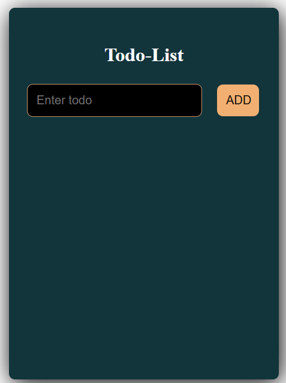
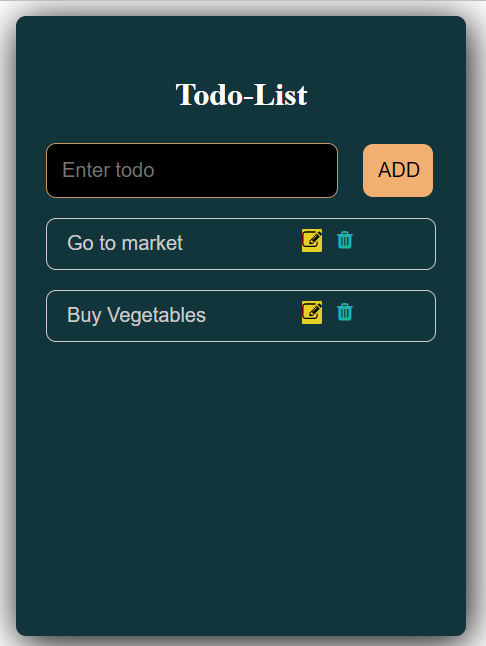
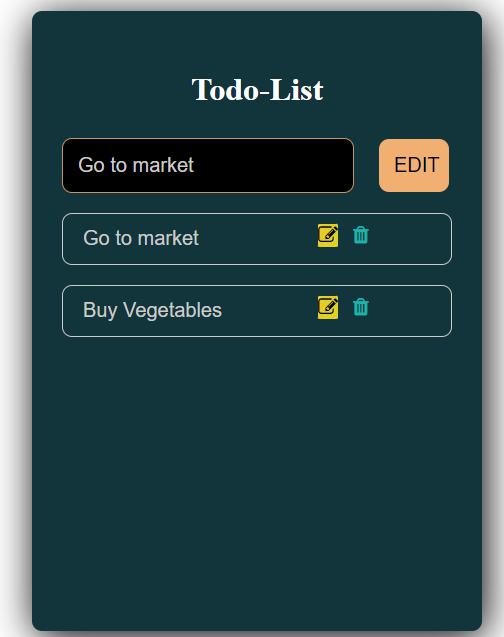
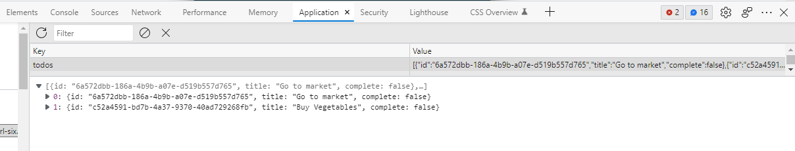

# Hi there! 

## Welcome to todo app with react js repository
  - Deployed Link :- https://todo-pearl-six.vercel.app/

  # Functunality Implemented 👍
   - Add
   - Edit
   - Delete
   - Local Storage

## See Some Photos

`Design`

`Add Todo`

`Edit`

`After Edit`

`Local Storage`

 ## Feel Free To Contact 🧑‍🤝‍🧑 :- 
   
  ### Email : alalu75666@gmail.com
  ### LinkedIn : https://www.linkedin.com/in/alal-uddin-066444206/

  ## THANK YOU..... 🤗 🤗 🤗 🤗 🤗 
  